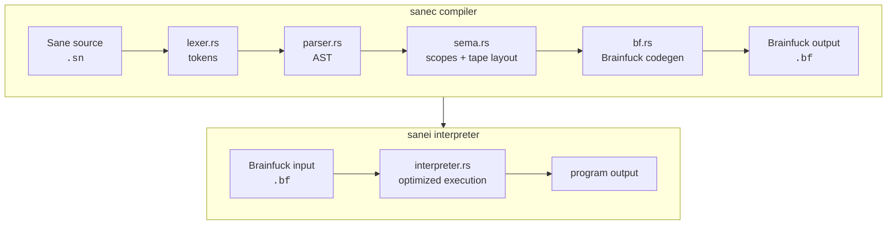

# Sane

Sane is a programming language that compiles to 8-bit Brainfuck.

The compiler is `sanec`; the bundled Brainfuck interpreter is `sanei`.

## Quick Start

```sh
cargo run --bin sanec -- examples/toy_aes_round.sn -o toy.bf
printf ABCDEFGHIJKLMNOP | cargo run --bin sanei -- toy.bf
```

Expected output:

```text
toy-aes:ED958E73EFAD3E04336822CC237B065A ok
```

Run tests:

```sh
cargo test
```

Show CLI help and version:

```sh
cargo run --bin sanec -- --help
cargo run --bin sanec -- --version
cargo run --bin sanei -- --help
cargo run --bin sanei -- --version
```

Annotate generated Brainfuck with a symbol table:

```sh
cargo run --bin sanec -- examples/toy_aes_round.sn -o toy.bf -s
```

## Architecture



## Language

Sane 1.0 has one value type: `byte`. A byte is an unsigned wrapping
8-bit value stored in one Brainfuck cell. All arithmetic wraps modulo 256.
Zero is false; any non-zero byte is true.

### Comments

Line comments start with `//`:

```text
// This is ignored by the compiler.
let x = 65;
```

### Variables

Variables are lexically scoped. A declaration without an initializer starts at
zero.

```text
let x: byte;
let y: byte = 65;
let z = 'A';
```

`let name = expr;` is shorthand for a `byte` declaration with an initializer.
Inner scopes may shadow outer names:

```text
let x = 'A';

{
    let x = 'B';
    put x; // B
}

put x; // A
```

### Arrays

Arrays are fixed-size byte arrays. Initializers must have exactly the declared
length, and each initializer element must be a constant byte expression.
Byte arrays can also be initialized from an ASCII string literal; Sane
does not add a trailing `\0`, so the string byte length must exactly match the
array length.

```text
let a: byte[4];
let sbox: byte[4] = [0x6, 0x4, 0xc, 0x5];
let msg: byte[6] = "hello\n";

a[0] = 65;
a[i] = a[i] ^ 0xff;
put a[i];
read a[i];
```

Constant indexes are checked at compile time. Dynamic indexes are not bounds checked in 1.0.

### Literals

Numeric literals may be decimal, binary, or hexadecimal:

```text
65
0b01000001
0x41
```

Character and string literals are ASCII-only:

```text
'A'
'\n'
"hello\n"
```

Supported escapes are `\n`, `\r`, `\t`, `\0`, `\\`, `\'`, and `\"`.

Booleans are byte literals:

```text
true  // 1
false // 0
```

### Assignment

Plain assignment replaces the destination byte. Compound assignment evaluates
the operation and writes the result back.

```text
x = expr;
a[i] = expr;

x += expr;
x -= expr;
x *= expr;
x /= expr;
x %= expr;
x &= expr;
x |= expr;
x ^= expr;
x <<= expr;
x >>= expr;
```

Array elements support plain assignment and compound assignment too:

```text
a[i] ^= key[i];
```

### Input And Output

`read` reads one byte. EOF reads as zero in the bundled interpreter.

```text
read x;
read a[i];
```

`put` writes one byte as a character. `puts` writes a string literal.
`print` writes a byte as unsigned decimal text, and `println` also writes a
newline.

```text
put 'A';
puts "answer=";
print 42;
println 255;
```

### Control Flow

Conditions are byte expressions. Zero is false; non-zero is true.

```text
if x == 0 {
    puts "zero\n";
} else if x < 10 {
    puts "small\n";
} else {
    puts "large\n";
}
```

Loops are structured:

```text
while x < 10 {
    x += 1;
}

loop {
    break;
}

for let i = 0; i < 4; i += 1 {
    put a[i];
}
```

`break` exits the nearest loop. `continue` skips the rest of the current
iteration. In a `for` loop, `continue` runs the step expression before checking
the condition again.

### Expressions

Expression forms:

```text
number
true
false
'A'
'\n'
name
array[index]
(expr)
!expr
~expr
expr op expr
```

Operator precedence, from tightest to loosest:

```text
parentheses
! ~
* / %
+ -
<< >>
== != < <= > >=
&
^
|
&&
||
```

Division by zero is defined:

```text
x / 0 == 0
x % 0 == x
```

Common examples:

```text
let x = 0b10101010;
let y = 0x0f;

put x & y;
put x | y;
put x ^ y;
put ~x;
put x << 1;
put x >> 2;
```

## Examples

The examples are real programs, not the language test matrix:

```text
examples/luhn4.sn          validates a 4-digit Luhn checksum
examples/toy_aes_round.sn  AES-inspired encrypt/decrypt round-trip
```

The test suite carries syntax and backend coverage.

## Memory Model

Generated Brainfuck uses a static tape layout:

```text
cell 0..7                  compiler temporaries
cell 8..scratch_base-1     source variables and arrays
cell scratch_base..+11     primitive scratch cells
cell control_base..        control-flow guard cells
```

Scalars occupy one cell. Arrays use four metadata cells
(`space`, `index1`, `index2`, `data`) followed by one cell per element.
Lexical-scope cells are returned to a simple free-list when their scope ends.

`sanec -s` writes the public symbol table into the generated Brainfuck as
BF-safe comments. The annotation avoids the eight Brainfuck instruction
characters, so `sanei` ignores it during execution.

## Interpreter

`sanei` filters non-Brainfuck characters, parses loops once, and applies
simple optimizations:

```text
+++----       combine adjacent add/sub
>>>>><        combine adjacent pointer moves
[-] or [+]    clear current cell
[->++<]       multiply-add transfer loop
```

The interpreter uses a 30,000-cell wrapping byte tape. EOF reads as `0`.

## Diagnostics

Compiler errors include source locations:

```text
expected Semi, found Put
  --> bad.sn:2:1
   |
 2 | put x;
   | ^
```

## Roadmap

Likely post-1.0 language work:

- functions with parameters, return values, and recursion-friendly call frames
- additional integer widths built on multiple Brainfuck cells
- safer array access options, such as checked indexing or debug-mode traps
- richer compile-time constants and initializer expressions
- optional syntax polish such as numeric separators
- a clearer module or file boundary once programs grow beyond single files
