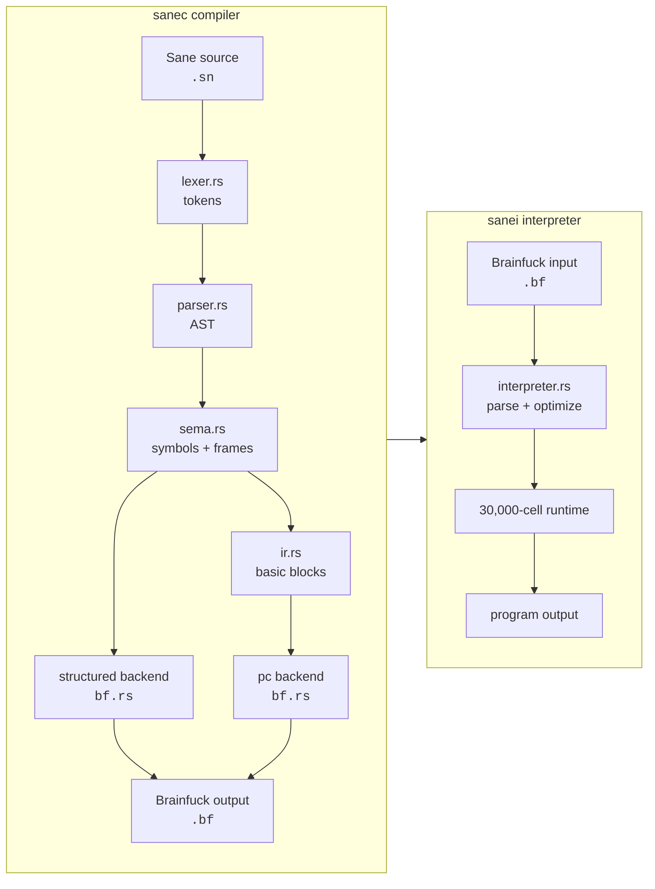

# Architecture

Sane is split into a compiler library, two command-line binaries, and an
optimized Brainfuck runtime.

## Pipeline



## Compiler Stages

1. `lexer.rs` converts source text into tokens and validates literals.
2. `parser.rs` builds the syntax tree for declarations, expressions, and control flow.
3. `sema.rs` resolves scopes and functions, validates symbols and call graphs,
   and assigns tape cells.
4. The structured backend in `bf.rs` lowers resolved syntax directly into
   Brainfuck loops and guards.
5. For the PC backend, `ir.rs` splits the program into basic blocks terminated
   by jumps, branches, calls, returns, or halt.
6. The PC code generator in `bf.rs` emits a dispatcher loop around those
   blocks.
7. The final Brainfuck pass removes redundant adjacent clear loops.

Diagnostics retain source spans through parsing and semantic analysis so errors
can point back to the original line and column.

## Tape Layout

The structured backend uses this static tape layout:

```text
cell 0..7                  compiler temporaries
cell 8..scratch_base-1     source variables and arrays
cell scratch_base..+11     primitive scratch cells
cell control_base..        control-flow guard cells
```

The PC backend reserves dispatcher and call-state cells at the start of the
control region:

```text
cell 0..7                  compiler temporaries
cell 8..scratch_base-1     globals, arrays, static function frames, spills
cell scratch_base..+11     primitive scratch cells
cell control_base+0        current block pc
cell control_base+1        running flag
cell control_base+2        dispatch pc copy
cell control_base+3        block matched flag
cell control_base+4        expected block id
cell control_base+5        return value (rv)
cell control_base+6        call depth
cell control_base+7..+22   return-pc stack
cell control_base+23..     control-flow guard cells
```

### Temporaries

Cells `0..7` are short-lived expression temporaries. Arithmetic and copy
microcode may overwrite them.

### Source Storage

Each scalar occupies one cell. Lexical-scope cells return to a free-list after
the scope ends, allowing later non-overlapping variables to reuse storage.

Function parameters and locals occupy static frame cells. Expression calls use
spill cells when a later call would overwrite an earlier result in `rv`.

Arrays occupy four metadata cells followed by their data:

```text
base + 0     space
base + 1     index1
base + 2     index2
base + 3     data transfer cell
base + 4..   array elements
```

Constant array accesses compile directly to a known data cell. Dynamic accesses
use the metadata cells and array traversal microcode.

### Scratch And Control Cells

The 12 primitive scratch cells support comparisons, division, bitwise
operations, shifts, and decimal printing. Control cells are allocated in a
stack-like manner while emitting nested conditions and loops.

## Control Flow Lowering

Brainfuck has loops but no jumps. Structured Sane control flow is implemented
with guard cells:

- `if` evaluates a boolean guard and executes its body at most once.
- `if/else` uses a second flag to select the else branch.
- loops reevaluate their condition through guard and recheck cells.
- `break` clears the active loop controls.
- `continue` clears the remaining-body guard and preserves the next iteration.

## PC Dispatch And Calls

The PC backend wraps the generated program in a dispatcher loop. Each basic
block compares its id with the current `pc`; the matching block performs its
operations and writes the next block id. A halt terminator clears `running` and
ends the dispatcher.

A call copies arguments into the callee's static frame, pushes the continuation
block id onto the 16-cell return-pc stack, and switches `pc` to the function's
entry block. A return writes its value to `rv`, pops the continuation, and
resumes dispatch there. Semantic analysis rejects recursive call graphs because
static frames cannot represent simultaneous activations of the same function.

## Interpreter Runtime

The normal interpreter parses Brainfuck into higher-level operations before
execution. The debugger intentionally uses raw instructions so breakpoints and
single stepping correspond directly to Brainfuck program counters.

Symbol comments produced by `sanec -s` are ignored during execution but parsed
by the debugger for tape inspection.
